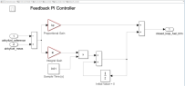
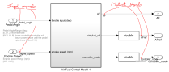
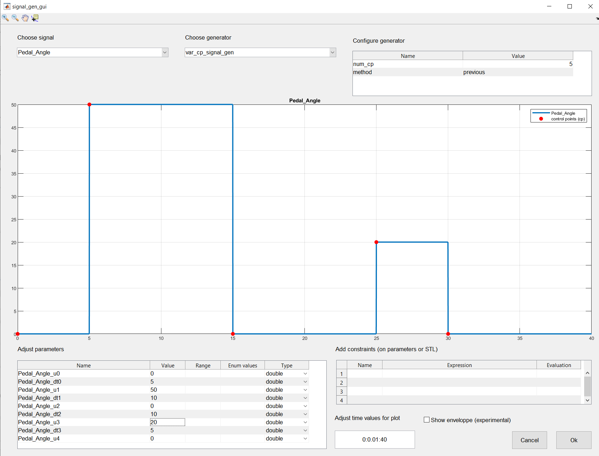

# Breach Toolbox
- [Introduction](#introduction)
- [Getting started](#getting-started)
  - [Setup](#setup)
  - [Builtin demos](#builtin-demos)
  - [Contact/Support](#contactsupport)
- [Importing time series data](#importing-time-series-data)
- [Monitoring Signal Temporal Logic (STL) Formulas](#monitoring-signal-temporal-logic-stl-formulas)
  - [Writing STL requirements in a file](#writing-stl-requirements-in-a-file)
  - [Evaluating an STL formula on data](#evaluating-an-stl-formula-on-data)
  - [Going further](#going-further)
- [Interfacing a Simulink model](#interfacing-a-simulink-model)
  - [Varying parameters](#varying-parameters)
  - [Signals](#signals)
    - [Top level input and output signals](#top-level-input-and-output-signals)
    - [Internal signals](#internal-signals)
  - [Input signals generation](#input-signals-generation)
  - [Going further](#going-further-1)
  - [Running and testing multiple simulations](#running-and-testing-multiple-simulations)
  - [Going further](#going-further-2)
- [Falsification](#falsification)
  - [Going further](#going-further-3)
- [Interfacing a generic simulator](#interfacing-a-generic-simulator)

[link](#section)

# Introduction 
<a id="introduction"></a>
Breach is a Matlab toolbox for time series analysis and simulation-based analysis of dynamical/CPS/Hybrid systems. It can be useful to the prospective user (you) in the following situations:
- You have **time series data** and wants to check whether it satisfies some property 
- You need **signal temporal logic (STL) monitoring capability**, e.g., to check formal requirements on your data
- You have a **Simulink models** and wants to perform **extensive testing** by running multiple simulations (e.g., parameter sweep) and quickly browse through the results, and/or assert whether some (STL) property is satisfied by simulations (random/Monte-Carlo testing) 
- You need to **falsify** an STL requirement using various optimization algorithm, i.e., find **test cases of interest** 
- You want to do some or all of the above to for a model implemented with **a simulator other than Simulink**.

The following describes the initial steps to get started with the above tasks.

# Getting started

## Setup 
To setup and use Breach, start Matlab and run `InitBreach` from the main Breach folder. This needs only to be done once per Matlab session.

## Builtin demos 
Type `BrDemo.` and `Tab` key to get a list of available scripts to run for testing and demoing the toolbox. E.g.,
```
>> BrDemo.AFC_1_Interface
```
Running `GenDoc()` will run all demos and publish results into the `Doc/index.html` folder. Note that this operation can take some time to complete. The index files is generated early in the process and the first sections are quickly available.   

## Contact/Support
Contact info at decyphir dot com to report bugs, for help, complaints, support, etc.

# Importing time series data

Breach handles times series as *traces*, which are objects consisting of data indexed with a time array, *i.e.*, a strictly increasing array starting at 0. For example: 
```matlab
not_time = [3 4 1 7];         % not valid because it is not increasing
not_time_either = [ 3 4 5 7]; % not valid because the first element is not 0
ok_time = [0 3 4 5 7];        % valid     
```
A trace can be imported in Breach as 2d arrays where the first column is the time array. The relevant object is a `BreachTraceSystem`. We create one by declaring the names of the *signal* traces it will contain, where a signal a function of time mapping a time value to a scalar.  Below we create one such object for, say, temperature and humidity data:
```matlab
Bdata = BreachTraceSystem({'temperature', 'humidity'});
```
It contains no data at this point.  Next we create some artificial data corresponding to one hypothetical day of measurment, and add it to `B`. 
```matlab
time = 0:.1:24; % in hours
temperature = 10 + 15*cos(pi*(time-3)/12+pi)+sin(pi/2*time); % in Celsius deg
humidity = 50 + 10*cos(pi*(time+2)/12)+sin(pi/3*time); % in percents
trace = [time' temperature' humidity']; % combine into a trace, column oriented
Bdata.AddTrace(trace);
```

A BreachTraceSystem object can contain multiple traces. Repeating the `AddTrace` call with a different trace will result in B containing two traces, etc. Traces can be plotted using the `PlotSignals` method: 
```matlab
>> Bdata.PlotSignals();
```  

# Monitoring Signal Temporal Logic (STL) Formulas

Signal Temporal Logic (STL) is a formalism to express predicates on the values of signals. STL formulas consist of atomic predicates connected by Boolean and temporal operators. For example, the formula `alw (temperature[t]<25) and ev_[0, 12] (humidity[t]>50)` for the synthetic data above means that the temperature stays below 25 all day and that at some point in the morning (0 being midnight and 12 being noon), the humidity gets above 50 percents. A formula is constructed using `STL_Formula` objects, which takes a name and a string as constructor arguments: 
```matlab
>>  phi = STL_Formula('phi', 'alw (temperature[t]<25) and ev_[0, 12] (humidity[t]>50)')
```
## Writing STL requirements in a file
STL formulas can be specified in a separate file, which makes it easier to create complex formulas using subformulas. Breach supports parameters also. The following illustrates rewriting the above formulas using Breach file format. 
```python
# File: Example_of_STL_spec_file.stl
# This is a comment. We define first parameters
param temp_threshold=25, humidity_threshold=50

# Atomic predicates are defined next
temp_is_ok       := temperature[t] < temp_threshold
humidity_is_high := humidity[t] > humidity_threshold

# Individual sub-formulas are defined next
temp_is_ok_all_day := alw (temp_is_ok)
humidity_is_high_before_noon := ev_[0, 12] (humidity_is_high)

# Final formula
phi := temp_is_ok_all_day and humidity_is_high_before_noon
```
To read an STL file, use the `STL_ReadFile`:
```matlab
>> STL_ReadFile('Example_of_STL_spec_file.stl')
```
Using this command defines all formulas in the file and make them available as STL_Formula objects in the Matlab workspace.

## Evaluating an STL formula on data

To evaluate an STL formula one needs to define a `BreachRequirement` object that can be constructed directly from an `STL_Formula`:
```matlab 
>> Rphi = BreachRequirement(phi);
```
A `BreachRequirement` object can store and combine more than one STL requirement or specification but this is its most common use. After creation, one can use the `Eval` method on data to check the satisfaction of its requirement. 
```matlab
>> Rphi.Eval(Bdata)

ans =

    0.4064
```
Note that the output is not a Boolean, but a real number. Breach computes so-called *quantitative* semantics, or *robustness*, of STL formulas. It can be interpreted as follows: if it is striclty positive, the formula is satisfied. If it is strictly negative, the formula is not satisfied by the data. When it is 0, it can be either way. The magnitude gives a hint of how "robustly" the formula is satisfied or violated. In this case, the number has a simple interpretation: the max temperature is about 24.6 Celsius degrees, i.e., about 0.4 degree below our threshold, which is the number we got. 

## Going further
For more information on specifications and how to use them, type this command into the Matlab prompt. 
```matlab
>> edit BrDemo.AFC_4_Specifications.m
```
and run the corresponding script. 

# Interfacing a Simulink model

Breach can act as a test harness for any Simulink model using the `BreachSimulinkSystem` class. To do so, one needs to decide which *parameters* Breach will be able to change before running a simulations and which *signals* will be monitored by Breach (these signals will be available for use in STL formulas). 

## Varying parameters
Varying parameters are most commonly those initialized in Matlab workspace before running Simulink. In the model itself, they reference the corresponding variable names. As a single example, consider the PI controller for the 'AbstractFuelControl' model (AFC in short, available in the Ext/Models folder) pictured below. The proportional gain and integral gain are using variables `kp` and `ki`. 



These parameters are initialised in the `InitAFCparams` script, along with others used elsewhere.  
```matlab
fuel_inj_tol = 1.0; 
(...)
kp = 0.04;
ki = 0.14;
```
Note that if the model has some callback script run before each simulation, these scripts should not redefine the parameters interfaced with Breach. 

## Signals
### Top level input and output signals
For a given Simulink model, input and output blocks are automatically monitored. In the AFC example from the diagram below, this means Breach will monitor input signals `Pedal_Angle` and `Engine_Speed` and output signals `AF`, `AFref` and `controller_mode`.



### Internal signals
In addition to input and output signals, internal lines marked for logging in a Simulink models as shown below are detected and monitored by Breach.  


## Input signals generation 

Once parameters and signals are defined, a `BreachSimulinkSystem` object can be created: 

```matlab 
BrDemo.InitAFCparams % this ensures that parameters needed by Simulink are initialized in the workspace
Bsim = BreachSimulinkSystem('AbstractFuelControl');
```

By default input signals are assigned constant value determined by parameters names `input_name_u0`. E.g., in the AFC case, they are `Engine_Speed_u0` and `Pedal_Angle_u0`. In Breach, there are many ways to assign input generator similar to what the signal builder in Simulink can do. The relevant method is `SetInputGen`.  Two basic usages are:
1. Constant time step input signals, using 
```matlab
Bsim.SetInputGen('UniStep3'); % creates 3 parameters for each input signals
```
2. Variable time step input signals, using 
```matlab
Bsim.SetInputGen('VarStep3'); % creates 3 parameters for each input signals value and 10 time parameters
```
In this case, parameters are named `input_name_u0,input_name_dt0, input_name_u1, input_name_dt1,...`, where the timing parameter `dt0` set the time difference between value `u0` and `u1`.
Many other options are available for signal generation. A GUI is available to explore some of them:
```
Bsim.SetInputGenGUI;
```




## Going further
For more information type these command into the Matlab prompt 
```matlab
>> edit BrDemo.AFC_1_Interface.m
>> edit BrDemo.AFC_2_Simulation.m
```
and run the corresponding scripts. 

## Running and testing multiple simulations
To generate multiple simulations, one need to assign a range or domain of variation for some parameter(s)
```matlab
BrDemo.InitAFC; %  Initialize the AFC model with a pulse generator for Pedal_Angle
var = {'Pedal_Angle_pulse_amp', 'Pedal_Angle_pulse_period'}; 
ranges = [ 10 60 ; 10 15] % ranges for pulse amplitude and pulse period
BrAFC.SetParamRanges(var, ranges); % declare ranges 
```
We can then sample this domain. The two most common methods for sampling are grid and quasi-random. 
 
```matlab
Bgrid = BrAFC.copy(); 
Bgrid.GridSample(5);  % creates a grid of 5x5=25 samples 

Brand = BrAFC.copy();
Brand.QuasiRandomSample(10);  % Creates 10 samples quasi-randomly in the specified range. 
```
`Brand` and `Bgrid` are now objects with multiple configurations for the `AFC` model.  Using the `Sim` will run all of them and store the corresponding traces. E.g., 

```matlab
Brand.Sim(40); % simulate AFC model until time 40
Brand.PlotSignals({'Pedal_Angle', 'AF'}); 
```
To test an STL requirement on 10 random simulations, we can simply eval it on `Brand`.

```matlab
STL_ReadFile(AFC_simple_spec.stl)
R = BreachRequirement(AF_alw_ok);
R.Eval(Brand)
``` 
The `Eval` method evaluate the requirement for all 10 but returns a single value, by default the minimum over the 10 evaluations. The function `BreachSamplesPlot` can be used to examine the results in detail. 
```matlab
BreachSamplesPlot(R)
```
## Going further
For more information on sampling sets, type the following command at the Matlab prompt 
```matlab
>> edit BrDemo.AFC_3_Sets.m
```
and run the corresponding script. 

# Falsification 

Falsification is the process of letting an optimization algorithm run simulations searching for one that will violates a requirement. To setup a falsification run in Breach, one needs to

1. create the interface and search space (e.g., a `BreachSimulinkSystem` object), 
2. create or choose the requirement (`BreachRequirement` object) and  
3. Create and setup a falsification problem (`FalsificationProblem`)

Steps 1. and 2. are the same as above when preparing for testing multiple traces. 
```matlab
% Step 1. create a BreachSimulinkSystem with variable parameters
BrDemo.InitAFC; % Initialize the AFC model with a pulse generator for Pedal_Angle
var = {'Pedal_Angle_pulse_amp', 'Pedal_Angle_pulse_period'}; 
ranges = [ 10 60 ; 10 15] % ranges for pulse amplitude and pulse period
BrAFC.SetParamRanges(var, ranges); 

% Step 2. Create a BreachRequirement object from an STL formula
STL_ReadFile(AFC_simple_spec.stl);
R = BreachRequirement(AF_alw_ok);
```
Step 3. is done directly by invoking the `FalsificationProblem` constructor: 
```matlab
pb = FalsificationProblem(BrAFC,R);
```
The problem is configured with default solver and options. Feeling adventurous, one can simply invoke the `solve` method to run falsification. Once it terminates, either after some time, or after finding a falsifying trace, results can be examined with the `GetLog` and `BreachSamplesPlot` functions. 
```matlab
pb.solve();
Rlog = pb.GetLog(); % returns a BreachRequirement object with evaluations of all traces computed during the falsification run
BreachSamplesPlot(Rlog); % interactive exploration of the run
```

## Going further
For more information on falsification problems, solvers, etc, type the following command at the Matlab prompt 
```matlab
>> edit BrDemo.AFC_5_Falsification.m
```
and run the corresponding script. 

# Interfacing a generic simulator

For simulators other than Simulink, Breach offers a generic mechanism
to create an interface. As an example, consider the code used to create artificial weather data above, slightly modified to include two parameters: 
```matlab
base_temp = 10; 
base_humidity = 50; 
time = 0:.1:24; % in hours
temperature = base_temp + 15*cos(pi*(time-3)/12+pi)+sin(pi/2*time); % in Celsius deg
humidity = base_humidity + 10*cos(pi*(time+2)/12)+sin(pi/3*time); % in percents
```
This is equivalent to having a (admitedly extremely simplified) weather simulator taking base temperature and humidity as parameters and returning temperature and humidity signals for one day. This code can be encapsulated in a function `sim_weather` and a Breach interface can be created with a `BreachSystem` object: 
```matlab
Bweather =  BreachSystem('weather', ...                 % system name 
                         {'temperature','humidity'},... % signals
                         {'base_temp','base_hum'},...   % parameters
                         [30 50], ...                   % default values for parameters
                         @sim_weather);
```

Then `Bweather` can be used to compute multiple traces varying parameters, monitor STL specifications, perform falsification, etc. Below is the complete, commented code for the  `sim_weather` function:

```matlab
function [t_out, X,p] = sim_weather(Sys, t_in, p) 
%  sim_weather computes one trace of the weather system, given a set of parameter vectors p
%  and a time specification t_in. 
%  
%  [t_out,X,p] = sim_weather(Sys,p,t_in) 
%  
%  Inputs: Sys, p and t_in are provided by Breach. 
%  - Sys is a structure with information about signals and parameters. In
%  particular,  Sys.ParamList is a cell of signals and parameter names such
%  that:
%     - Sys.ParamList(1:Sys.DimX) returns names of all signals
%     - Sys.ParamList(Sys.DimX+1:Sys.DimP) returns the names of constant parameters    
%  -  p is an array of length Sys.DimX+Sys.DimP. 
%  -  t_in is of the form [0 t_in(end)]  or [0 t_in(2) ... t_in(end)], strictly increasing
% 
%  Outputs:  simfn has to return the following:    
%      - t_out must be such that t_out(1) =0 and t_out(end) = t_in(end). 
%        In addition, if t_in has more than two elements, then t_out must be
%        equal to t_in. Otherwise, t_out can have as many elements as
%        returned by the simulation.
%     - X must be of dimensions (Sys.DimX, t_out). The rows of X must
%     contain simulation results for signals named in Sys.ParamList(1:DimX)
%    -  p is the same as p unless the simulator changes it (outputs scalars
%           in addition to signals)

% recover parameters from p - for legacy reason, the first elements in p
% are for signals, and parameters start at index Sys.DimX+1 = 3
base_temp =p(3);
base_hum = p(4); 

% compute signals - a simple function of time in this case but for a more complex 
% simulator, this is where the actual call to the simulator will take place
temperature = base_temp + 15*cos(pi*(t_in-3)/12+pi)+sin(pi/2*t_in); % in Celsius deg
humidity = base_hum + 10*cos(pi*(t_in+2)/12)+sin(pi/3*t_in); % in percents

% format outputs as expected by Breach
X = [temperature;     
     humidity]; 
t_out = t_in;             

end
```
